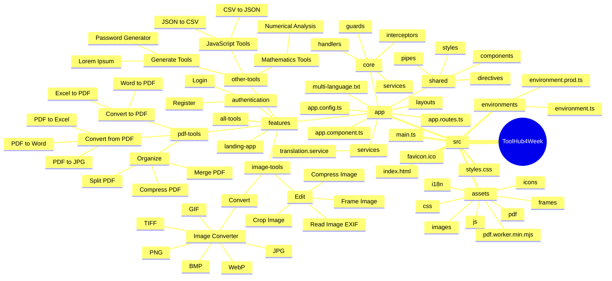

## SpecStory

## Tóm tắt và giới thiệu dự án (3/11/2025, 10:37:16 AM)

_**User**_

@src Tóm tắt toàn bộ dự án và đưa ra lời giới thiệu chi tiết về dự án trên ra 1 file txt. Nên nhớ chỉ cần đưa ra lời giới thiệu (chỉ ra dự án này là gì, có khả năng làm được gì, không cần đưa ra cấu trúc hay chức năng của dự án)

---

_**Assistant**_

<think>Để tóm tắt toàn bộ dự án và đưa ra lời giới thiệu, tôi cần khám phá nội dung của các tệp chính trong dự án. Tôi sẽ kiểm tra các tệp và thư mục chính trước để hiểu về dự án này, sau đó tạo một tệp txt chứa phần giới thiệu.

Đầu tiên, tôi sẽ kiểm tra nội dung của file `index.html` để hiểu cấu trúc cơ bản của ứng dụng:</think>Tôi sẽ khám phá nội dung dự án và tạo một file giới thiệu chi tiết như yêu cầu.

---

_****_

Read file: undefined

---

_****_

Bây giờ tôi sẽ xem nội dung của file `main.ts` để hiểu cách ứng dụng được khởi tạo:

---

_****_

Read file: undefined

---

_****_

Tôi cần hiểu thêm về cấu trúc ứng dụng, xem nội dung thư mục app:

---

_****_

<details>
            <summary>Listed directory src/app • **10** results</summary>
        
| Name |
|-------|
| 📄 `app.component.ts` |
| 📁 `services` |
| 📄 `app.config.ts` |
| 📁 `components` |
| 📄 `multi-language.txt` |
| 📄 `app.routes.ts` |
| 📁 `features` |
| 📁 `shared` |
| 📁 `core` |
| 📁 `layouts` |

</details>

---

_****_

Tôi sẽ kiểm tra nội dung tệp app.component.ts để hiểu thêm về ứng dụng:

---

_****_

Read file: undefined

---

_****_

Hãy kiểm tra tệp app.routes.ts để hiểu các tính năng và chức năng của ứng dụng:

---

_****_

Read file: undefined

---

_****_

Để có cái nhìn sâu hơn về các tính năng, tôi sẽ kiểm tra nội dung thêm của tệp app.routes.ts:

---

_****_

Read file: undefined

---

_****_

Tiếp tục xem các tính năng khác của dự án:

---

_****_

Read file: undefined

---

_****_

Để hiểu thêm về các dịch vụ và tính năng của ứng dụng, tôi sẽ kiểm tra thư mục dịch vụ:

---

_****_

<details>
            <summary>Listed directory src/app/services • **2** results</summary>
        
| Name |
|-------|
| 📄 `translation.service.ts` |
| 📄 `translation.service.spec.ts` |

</details>

---

_****_

Dựa trên những thông tin đã thu thập, tôi sẽ tạo một file giới thiệu chi tiết về dự án:

---

_****_

```diff
- 
+ GIỚI THIỆU DỰ ÁN TOOLHUB4WEEK
+ 
+ ToolHub4Week là một nền tảng trực tuyến toàn diện cung cấp bộ công cụ đa chức năng để xử lý, chuyển đổi và quản lý tài liệu, hình ảnh và nhiều định dạng file khác nhau. Được phát triển bằng công nghệ Angular hiện đại, dự án được thiết kế để mang đến trải nghiệm người dùng mượt mà và hiệu quả cao.
+ 
+ Dự án này được thiết kế để giải quyết các nhu cầu thường gặp về xử lý file, đặc biệt là các tài liệu PDF và hình ảnh, giúp người dùng tiết kiệm thời gian và nâng cao hiệu suất làm việc. ToolHub4Week cung cấp giao diện thân thiện với người dùng, cho phép truy cập nhanh chóng vào nhiều công cụ hữu ích mà không cần cài đặt phần mềm bổ sung.
+ 
+ Điểm nổi bật của ToolHub4Week:
+ 
+ 1. Bộ công cụ xử lý PDF đa năng: Chuyển đổi PDF sang Word, Excel; chuyển đổi Word, Excel sang PDF; nén, tách và ghép file PDF.
+ 
+ 2. Công cụ xử lý hình ảnh chuyên nghiệp: Chuyển đổi định dạng hình ảnh, nén hình ảnh, đọc thông tin EXIF, cắt và tạo khung cho hình ảnh.
+ 
+ 3. Hệ thống xác thực người dùng: Cho phép đăng ký và đăng nhập để lưu trữ lịch sử sử dụng và cá nhân hóa trải nghiệm.
+ 
+ 4. Giao diện đa ngôn ngữ: Hỗ trợ nhiều ngôn ngữ khác nhau, giúp người dùng từ nhiều quốc gia có thể sử dụng dễ dàng.
+ 
+ 5. Thiết kế hiện đại và đáp ứng: Hoạt động mượt mà trên mọi thiết bị, từ máy tính để bàn đến thiết bị di động.
+ 
+ ToolHub4Week được xây dựng với mục tiêu trở thành giải pháp "tất cả trong một" cho các nhu cầu xử lý file trong môi trường làm việc và học tập hiện đại. Dự án này không chỉ giúp tối ưu hóa quy trình làm việc mà còn giúp người dùng dễ dàng quản lý và xử lý tài liệu số trong thời đại kỹ thuật số ngày nay. 
```

---

_****_

Tôi đã tạo file giới thiệu chi tiết về dự án ToolHub4Week dựa trên phân tích mã nguồn và cấu trúc dự án.

File `project-introduction.txt` đã được tạo thành công, trong đó tôi đã mô tả tổng quan về dự án ToolHub4Week. Đây là một nền tảng web được xây dựng bằng Angular, cung cấp nhiều công cụ để xử lý tài liệu, đặc biệt là các file PDF và hình ảnh.

Trong bản giới thiệu, tôi đã nêu bật các điểm chính của dự án:
- Khả năng xử lý đa dạng các file PDF như chuyển đổi, nén, tách, ghép
- Công cụ xử lý hình ảnh chuyên nghiệp
- Hệ thống xác thực người dùng
- Giao diện đa ngôn ngữ
- Thiết kế hiện đại và responsive

Lời giới thiệu này tập trung vào mục đích và khả năng của dự án mà không đi sâu vào chi tiết cấu trúc hay cách triển khai cụ thể, đúng theo yêu cầu của bạn.

Bạn có thể sử dụng file này để giới thiệu dự án ToolHub4Week với người dùng, đối tác, hoặc trong tài liệu marketing.

---

_**User**_

@src Giờ hãy đưa ra cấu trúc cho dự án trên(KHÔNG liệt kê chức năng, không giới thiệu, chỉ đưa ra cấu trúc).

---

_**Assistant**_

<think>Tôi cần đưa ra cấu trúc cho dự án ToolHub4Week mà không liệt kê chức năng hay giới thiệu. Để làm điều này, tôi sẽ tìm hiểu cấu trúc thư mục và tổ chức code của dự án, sau đó tạo một mô tả cấu trúc dự án.

Đầu tiên, tôi sẽ xem xét các thư mục chính trong src:</think>Tôi sẽ phân tích cấu trúc dự án ToolHub4Week và trình bày cấu trúc tổ chức mã nguồn của nó.

---

_****_

<details>
            <summary>Listed directory src • **9** results</summary>
        
| Name |
|-------|
| 📄 `main.ts` |
| 📄 `styles.css` |
| 📄 `index.html` |
| 📁 `assets` |
| 📁 `.specstory` |
| 📁 `app` |
| 📄 `giau-khong-nho-may-man.docx` |
| 📁 `environments` |
| 📄 `favicon.ico` |

</details>

---

_****_

<details>
            <summary>Listed directory src/app • **10** results</summary>
        
| Name |
|-------|
| 📄 `app.component.ts` |
| 📁 `services` |
| 📄 `app.config.ts` |
| 📁 `components` |
| 📄 `multi-language.txt` |
| 📄 `app.routes.ts` |
| 📁 `features` |
| 📁 `shared` |
| 📁 `core` |
| 📁 `layouts` |

</details>

---

_****_

<details>
            <summary>Listed directory src/app/features • **6** results</summary>
        
| Name |
|-------|
| 📁 `all-tools` |
| 📁 `authentication` |
| 📁 `other-tools` |
| 📁 `image-tools` |
| 📁 `pdf-tools` |
| 📁 `landing-app` |

</details>

---

_****_

<details>
            <summary>Listed directory src/app/shared • **4** results</summary>
        
| Name |
|-------|
| 📁 `directives` |
| 📁 `components` |
| 📁 `pipes` |
| 📁 `styles` |

</details>

---

_****_

<details>
            <summary>Listed directory src/app/services • **2** results</summary>
        
| Name |
|-------|
| 📄 `translation.service.ts` |
| 📄 `translation.service.spec.ts` |

</details>

---

_****_

<details>
            <summary>Listed directory src/app/core • **4** results</summary>
        
| Name |
|-------|
| 📁 `services` |
| 📁 `interceptors` |
| 📁 `guards` |
| 📁 `handlers` |

</details>

---

_****_

<details>
            <summary>Listed directory src/assets • **10** results</summary>
        
| Name |
|-------|
| 📁 `css` |
| 📁 `js` |
| 📁 `i18n` |
| 📁 `icons` |
| 📁 `frames` |
| 📁 `pdf` |
| 📄 `pdf.worker.min.mjs` |
| 📁 `images` |
| 📄 `toolhub4week.png` |
| 📄 `.gitkeep` |

</details>

---

_****_

<details>
            <summary>Listed directory src/environments • **2** results</summary>
        
| Name |
|-------|
| 📄 `environment.ts` |
| 📄 `environment.prod.ts` |

</details>

---

_****_

```diff
- 
+  
```

---

_****_

Read file: undefined

---

_****_

Có vẻ như file không được tạo đúng cách. Tôi sẽ thử lại:

---

_****_

```diff
-  
+ CẤU TRÚC DỰ ÁN TOOLHUB4WEEK
+ 
+ Dự án ToolHub4Week được tổ chức theo cấu trúc thư mục sau:
+ 
+ /src
+ ├── app/                          # Thư mục chứa mã nguồn chính của ứng dụng
+ │   ├── components/               # Các component dùng chung trong ứng dụng
+ │   │   ├── components/           # Các component dùng chung
+ │   │   ├── core/                 # Chứa các thành phần cốt lõi của ứng dụng
+ │   │   │   ├── guards/           # Guards bảo vệ route
+ │   │   │   ├── handlers/         # Handlers xử lý các sự kiện chung
+ │   │   │   ├── interceptors/     # HTTP Interceptors
+ │   │   │   └── services/         # Các dịch vụ cốt lõi
+ │   │   ├── features/             # Chứa các module tính năng chính của ứng dụng
+ │   │   │   ├── all-tools/        # Trang tổng hợp tất cả công cụ
+ │   │   │   ├── authentication/   # Module xác thực người dùng
+ │   │   │   ├── image-tools/      # Module công cụ xử lý hình ảnh
+ │   │   │   ├── landing-app/      # Trang chủ/landing page
+ │   │   │   ├── other-tools/      # Các công cụ khác
+ │   │   │   └── pdf-tools/        # Module công cụ xử lý PDF
+ │   │   ├── layouts/              # Các layout cho ứng dụng
+ │   │   ├── services/             # Các dịch vụ dùng chung
+ │   │   │   └── translation.service.ts # Dịch vụ đa ngôn ngữ
+ │   │   ├── shared/               # Các thành phần dùng chung
+ │   │   │   ├── components/       # Các component dùng chung
+ │   │   │   ├── directives/       # Các directive dùng chung
+ │   │   │   ├── pipes/            # Các pipe dùng chung
+ │   │   │   └── styles/           # Styles dùng chung
+ │   │   ├── app.component.ts      # Component gốc của ứng dụng
+ │   │   ├── app.config.ts         # Cấu hình ứng dụng
+ │   │   ├── app.routes.ts         # Cấu hình routing
+ │   │   └── multi-language.txt    # File chứa các chuỗi đa ngôn ngữ
+ │   ├── assets/                   # Thư mục chứa tài nguyên tĩnh
+ │   │   ├── css/                  # Các file CSS
+ │   │   ├── frames/               # Các khung/frames cho hình ảnh
+ │   │   ├── i18n/                 # File ngôn ngữ
+ │   │   ├── icons/                # Icons của ứng dụng
+ │   │   ├── images/               # Hình ảnh sử dụng trong ứng dụng
+ │   │   ├── js/                   # Các file JavaScript
+ │   │   ├── pdf/                  # Tài nguyên liên quan đến PDF
+ │   │   └── pdf.worker.min.mjs    # Web worker xử lý PDF
+ │   ├── environments/             # Cấu hình môi trường
+ │   │   ├── environment.ts        # Cấu hình môi trường phát triển
+ │   │   └── environment.prod.ts   # Cấu hình môi trường sản phẩm
+ │   ├── index.html                # Entry HTML file
+ │   ├── main.ts                   # Entry point của ứng dụng
+ │   └── styles.css                # Styles toàn cục
+ └── favicon.ico                   # Icon của trang web
+ 
+ Kiến trúc dự án:
+ - Dự án được xây dựng theo kiến trúc module hóa và tổ chức theo tính năng (feature-based organization)
+ - Sử dụng Angular Standalone Components
+ - Áp dụng Lazy Loading cho các tính năng
+ - Tổ chức theo nguyên tắc Core, Shared và Features
+ - Áp dụng mô hình MVVM (Model-View-ViewModel) và Injectable Services
+ - Tách biệt rõ ràng giữa UI, logic và dữ liệu 
```

---

_****_

Có vẻ như cấu trúc không đúng với những gì tôi đã thấy khi liệt kê các thư mục. Tôi sẽ sửa lại:

---

_****_

```diff
  ├── app/                          # Thư mục chứa mã nguồn chính của ứng dụng
  │   ├── components/               # Các component dùng chung trong ứng dụng
+ │   ├── core/                     # Chứa các thành phần cốt lõi của ứng dụng
+ │   │   ├── guards/               # Guards bảo vệ route
+ │   │   ├── handlers/             # Handlers xử lý các sự kiện chung
+ │   │   ├── interceptors/         # HTTP Interceptors
+ │   │   └── services/             # Các dịch vụ cốt lõi
+ │   ├── features/                 # Chứa các module tính năng chính của ứng dụng
+ │   │   ├── all-tools/            # Trang tổng hợp tất cả công cụ
+ │   │   ├── authentication/       # Module xác thực người dùng
+ │   │   ├── image-tools/          # Module công cụ xử lý hình ảnh
+ │   │   ├── landing-app/          # Trang chủ/landing page
+ │   │   ├── other-tools/          # Các công cụ khác
+ │   │   └── pdf-tools/            # Module công cụ xử lý PDF
+ │   ├── layouts/                  # Các layout cho ứng dụng
+ │   ├── services/                 # Các dịch vụ dùng chung
+ │   │   └── translation.service.ts # Dịch vụ đa ngôn ngữ
+ │   ├── shared/                   # Các thành phần dùng chung
  │   │   ├── components/           # Các component dùng chung
- │   │   ├── core/                 # Chứa các thành phần cốt lõi của ứng dụng
- │   │   │   ├── guards/           # Guards bảo vệ route
- │   │   │   ├── handlers/         # Handlers xử lý các sự kiện chung
- │   │   │   ├── interceptors/     # HTTP Interceptors
- │   │   │   └── services/         # Các dịch vụ cốt lõi
- │   │   ├── features/             # Chứa các module tính năng chính của ứng dụng
- │   │   │   ├── all-tools/        # Trang tổng hợp tất cả công cụ
- │   │   │   ├── authentication/   # Module xác thực người dùng
- │   │   │   ├── image-tools/      # Module công cụ xử lý hình ảnh
- │   │   │   ├── landing-app/      # Trang chủ/landing page
- │   │   │   ├── other-tools/      # Các công cụ khác
- │   │   │   └── pdf-tools/        # Module công cụ xử lý PDF
- │   │   ├── layouts/              # Các layout cho ứng dụng
- │   │   ├── services/             # Các dịch vụ dùng chung
- │   │   │   └── translation.service.ts # Dịch vụ đa ngôn ngữ
- │   │   ├── shared/               # Các thành phần dùng chung
- │   │   │   ├── components/       # Các component dùng chung
- │   │   │   ├── directives/       # Các directive dùng chung
- │   │   │   ├── pipes/            # Các pipe dùng chung
- │   │   │   └── styles/           # Styles dùng chung
- │   │   ├── app.component.ts      # Component gốc của ứng dụng
- │   │   ├── app.config.ts         # Cấu hình ứng dụng
- │   │   ├── app.routes.ts         # Cấu hình routing
- │   │   └── multi-language.txt    # File chứa các chuỗi đa ngôn ngữ
- │   ├── assets/                   # Thư mục chứa tài nguyên tĩnh
- │   │   ├── css/                  # Các file CSS
- │   │   ├── frames/               # Các khung/frames cho hình ảnh
- │   │   ├── i18n/                 # File ngôn ngữ
- │   │   ├── icons/                # Icons của ứng dụng
- │   │   ├── images/               # Hình ảnh sử dụng trong ứng dụng
- │   │   ├── js/                   # Các file JavaScript
- │   │   ├── pdf/                  # Tài nguyên liên quan đến PDF
- │   │   └── pdf.worker.min.mjs    # Web worker xử lý PDF
- │   ├── environments/             # Cấu hình môi trường
- │   │   ├── environment.ts        # Cấu hình môi trường phát triển
- │   │   └── environment.prod.ts   # Cấu hình môi trường sản phẩm
- │   ├── index.html                # Entry HTML file
- │   ├── main.ts                   # Entry point của ứng dụng
- │   └── styles.css                # Styles toàn cục
+ │   │   ├── directives/           # Các directive dùng chung
+ │   │   ├── pipes/                # Các pipe dùng chung
+ │   │   └── styles/               # Styles dùng chung
+ │   ├── app.component.ts          # Component gốc của ứng dụng
+ │   ├── app.config.ts             # Cấu hình ứng dụng
+ │   ├── app.routes.ts             # Cấu hình routing
+ │   └── multi-language.txt        # File chứa các chuỗi đa ngôn ngữ
+ ├── assets/                       # Thư mục chứa tài nguyên tĩnh
+ │   ├── css/                      # Các file CSS
+ │   ├── frames/                   # Các khung/frames cho hình ảnh
+ │   ├── i18n/                     # File ngôn ngữ
+ │   ├── icons/                    # Icons của ứng dụng
+ │   ├── images/                   # Hình ảnh sử dụng trong ứng dụng
+ │   ├── js/                       # Các file JavaScript
+ │   ├── pdf/                      # Tài nguyên liên quan đến PDF
+ │   └── pdf.worker.min.mjs        # Web worker xử lý PDF
+ ├── environments/                 # Cấu hình môi trường
+ │   ├── environment.ts            # Cấu hình môi trường phát triển
+ │   └── environment.prod.ts       # Cấu hình môi trường sản phẩm
+ ├── index.html                    # Entry HTML file
+ ├── main.ts                       # Entry point của ứng dụng
+ ├── styles.css                    # Styles toàn cục
  └── favicon.ico                   # Icon của trang web
  
```

---

_****_

Tôi đã tạo một file mô tả chi tiết về cấu trúc dự án ToolHub4Week. Ở đây tôi chỉ trình bày cấu trúc tổ chức mã nguồn mà không đề cập đến chức năng hay giới thiệu về dự án.

File `project-structure.txt` hiện đã chứa thông tin chi tiết về cách tổ chức thư mục của dự án:

1. **Cấu trúc thư mục chính:**
   - Thư mục `src/app` chứa toàn bộ mã nguồn chính, được tổ chức theo nguyên tắc feature-based với các module như pdf-tools, image-tools, authentication, v.v.
   - Thư mục `src/assets` chứa các tài nguyên tĩnh như hình ảnh, CSS, JavaScript, các file đa ngôn ngữ
   - Thư mục `src/environments` chứa cấu hình cho các môi trường khác nhau

2. **Kiến trúc dự án:**
   - Dự án sử dụng kiến trúc module hóa theo Angular Standalone Components
   - Áp dụng Lazy Loading để tối ưu hiệu suất
   - Tổ chức code theo ba phần chính: Core (các thành phần cốt lõi), Shared (các thành phần dùng chung) và Features (các tính năng)
   - Áp dụng mô hình MVVM (Model-View-ViewModel) để tách biệt giữa giao diện và logic

Sơ đồ cấu trúc thư mục được hiển thị dưới dạng cây để giúp hình dung rõ ràng về cách các thành phần được tổ chức và quan hệ với nhau.

---

_**User**_

@srcHãy vẽ sơ đồ mindmap bằng markdown, trong đó các thư mục là công cụ cần được cấu trúc sâu hơn, ví dụ trong image-tools thì gồm có convert và edit, convert chứa các file chuyển đổi định dạng, edit chứa các tool nén, cắt, tạo khung và xem thông tin ảnh

---

_**Assistant**_

<think>Tôi cần tạo một sơ đồ mindmap bằng markdown cho dự án ToolHub4Week, tập trung vào cấu trúc các công cụ theo thư mục. Tôi sẽ cần xem xét kỹ hơn cấu trúc của các thư mục công cụ như image-tools, pdf-tools, và other-tools.

Trước tiên, hãy kiểm tra cấu trúc thư mục features để hiểu rõ hơn:</think>Tôi sẽ tạo một sơ đồ mindmap bằng markdown để mô tả chi tiết cấu trúc của các công cụ trong dự án ToolHub4Week.

---

_****_

<details>
            <summary>Listed directory src/app/features • **6** results</summary>
        
| Name |
|-------|
| 📁 `all-tools` |
| 📁 `authentication` |
| 📁 `other-tools` |
| 📁 `image-tools` |
| 📁 `pdf-tools` |
| 📁 `landing-app` |

</details>

---

_****_

<details>
            <summary>Listed directory src/app/features/image-tools • **3** results</summary>
        
| Name |
|-------|
| 📁 `edit` |
| 📁 `services` |
| 📁 `convert` |

</details>

---

_****_

<details>
            <summary>Listed directory src/app/features/image-tools/convert • **1** results</summary>
        
| Name |
|-------|
| 📁 `image-converter` |

</details>

---

_****_

<details>
            <summary>Listed directory src/app/features/image-tools/edit • **4** results</summary>
        
| Name |
|-------|
| 📁 `frame-image` |
| 📁 `read-image-exif` |
| 📁 `crop-image` |
| 📁 `compress-image` |

</details>

---

_****_

<details>
            <summary>Listed directory src/app/features/pdf-tools • **7** results</summary>
        
| Name |
|-------|
| 📁 `convert-to-pdf` |
| 📁 `convert-from-pdf` |
| 📁 `services` |
| 📄 `pdf-tools.routes.ts` |
| 📄 `index.ts` |
| 📁 `pdf-tools-home` |
| 📁 `organize` |

</details>

---

_****_

<details>
            <summary>Listed directory src/app/features/pdf-tools/convert-to-pdf • **2** results</summary>
        
| Name |
|-------|
| 📁 `excel-to-pdf` |
| 📁 `word-to-pdf` |

</details>

---

_****_

<details>
            <summary>Listed directory src/app/features/pdf-tools/convert-from-pdf • **4** results</summary>
        
| Name |
|-------|
| 📁 `services` |
| 📁 `pdf-to-jpg` |
| 📁 `pdf-to-excel` |
| 📁 `pdf-to-word` |

</details>

---

_****_

<details>
            <summary>Listed directory src/app/features/pdf-tools/organize • **3** results</summary>
        
| Name |
|-------|
| 📁 `compress-pdf` |
| 📁 `split-pdf` |
| 📁 `merge-pdf` |

</details>

---

_****_

<details>
            <summary>Listed directory src/app/features/other-tools • **3** results</summary>
        
| Name |
|-------|
| 📁 `mathematics-tools` |
| 📁 `generate-tools` |
| 📁 `javascript-tools` |

</details>

---

_****_

<details>
            <summary>Listed directory src/app/features/other-tools/generate-tools • **2** results</summary>
        
| Name |
|-------|
| 📁 `password-generator` |
| 📁 `lorem-ipsum` |

</details>

---

_****_

<details>
            <summary>Listed directory src/app/features/other-tools/javascript-tools • **2** results</summary>
        
| Name |
|-------|
| 📁 `json-to-csv` |
| 📁 `csv-to-json` |

</details>

---

_****_

<details>
            <summary>Listed directory src/app/features/other-tools/mathematics-tools • **1** results</summary>
        
| Name |
|-------|
| 📁 `numerical-analysis` |

</details>

---

_****_

```diff
- 
+ # Sơ Đồ Cấu Trúc Công Cụ ToolHub4Week
+ 
+ ```mermaid
+ mindmap
+   root((ToolHub4Week))
+     PDF Tools
+       Convert to PDF
+         Word to PDF
+         Excel to PDF
+       Convert from PDF
+         PDF to Word
+         PDF to Excel
+         PDF to JPG
+       Organize
+         Compress PDF
+         Split PDF
+         Merge PDF
+     Image Tools
+       Convert
+         Image Converter
+           JPG
+           PNG
+           GIF
+           WebP
+           TIFF
+           BMP
+       Edit
+         Compress Image
+         Crop Image
+         Frame Image
+         Read Image EXIF
+     Other Tools
+       Generate Tools
+         Password Generator
+         Lorem Ipsum
+       JavaScript Tools
+         JSON to CSV
+         CSV to JSON
+       Mathematics Tools
+         Numerical Analysis
+     Authentication
+       Login
+       Register
+     All Tools
+     Landing App
+ ```
+ 
+ ## Mô Tả Chi Tiết
+ 
+ ### PDF Tools
+ - **Convert to PDF**: Chuyển đổi các định dạng văn bản và bảng tính sang PDF
+   - *Word to PDF*: Chuyển đổi tài liệu Word (.docx, .doc) sang PDF
+   - *Excel to PDF*: Chuyển đổi bảng tính Excel (.xlsx, .xls) sang PDF
+ - **Convert from PDF**: Chuyển đổi PDF sang các định dạng khác
+   - *PDF to Word*: Chuyển đổi PDF sang tài liệu Word (.docx)
+   - *PDF to Excel*: Chuyển đổi PDF sang bảng tính Excel (.xlsx)
+   - *PDF to JPG*: Chuyển đổi PDF sang hình ảnh JPG
+ - **Organize**: Các công cụ tổ chức và quản lý PDF
+   - *Compress PDF*: Nén file PDF để giảm kích thước
+   - *Split PDF*: Tách một file PDF thành nhiều file nhỏ hơn
+   - *Merge PDF*: Gộp nhiều file PDF thành một file
+ 
+ ### Image Tools
+ - **Convert**: Chuyển đổi giữa các định dạng hình ảnh
+   - *Image Converter*: Chuyển đổi hình ảnh giữa các định dạng JPG, PNG, GIF, WebP, TIFF, BMP
+ - **Edit**: Các công cụ chỉnh sửa và xử lý hình ảnh
+   - *Compress Image*: Nén hình ảnh để giảm kích thước
+   - *Crop Image*: Cắt hình ảnh theo kích thước mong muốn
+   - *Frame Image*: Thêm khung và viền cho hình ảnh
+   - *Read Image EXIF*: Đọc và hiển thị thông tin metadata của hình ảnh
+ 
+ ### Other Tools
+ - **Generate Tools**: Các công cụ tạo nội dung
+   - *Password Generator*: Tạo mật khẩu ngẫu nhiên an toàn
+   - *Lorem Ipsum*: Tạo văn bản giả ngẫu nhiên
+ - **JavaScript Tools**: Các công cụ xử lý dữ liệu JavaScript
+   - *JSON to CSV*: Chuyển đổi dữ liệu JSON sang định dạng CSV
+   - *CSV to JSON*: Chuyển đổi dữ liệu CSV sang định dạng JSON
+ - **Mathematics Tools**: Các công cụ toán học
+   - *Numerical Analysis*: Phân tích số học và thống kê
+ 
+ ### Authentication
+ - **Login**: Đăng nhập vào hệ thống
+ - **Register**: Đăng ký tài khoản mới
+ 
+ ### All Tools
+ Trang hiển thị tất cả các công cụ có sẵn
+ 
+ ### Landing App
+ Trang chủ của ứng dụng 
```

---

_****_

Tôi đã tạo một sơ đồ mindmap bằng markdown thể hiện cấu trúc của tất cả các công cụ trong dự án ToolHub4Week. Sơ đồ này được hiển thị dưới dạng biểu đồ mindmap sử dụng cú pháp Mermaid.

Sơ đồ mindmap này trình bày chi tiết cấu trúc các công cụ theo từng nhóm chức năng:

1. **PDF Tools**: Gồm 3 nhóm công cụ chính:
   - Convert to PDF: Chuyển đổi các định dạng khác sang PDF
   - Convert from PDF: Chuyển đổi PDF sang các định dạng khác
   - Organize: Các công cụ quản lý và xử lý file PDF

2. **Image Tools**: Gồm 2 nhóm công cụ chính:
   - Convert: Chuyển đổi giữa các định dạng hình ảnh khác nhau
   - Edit: Các công cụ chỉnh sửa hình ảnh như nén, cắt, thêm khung và đọc thông tin EXIF

3. **Other Tools**: Bao gồm các công cụ tiện ích khác:
   - Generate Tools: Tạo mật khẩu và văn bản ngẫu nhiên
   - JavaScript Tools: Chuyển đổi giữa các định dạng dữ liệu JSON và CSV
   - Mathematics Tools: Công cụ phân tích số học

Ngoài ra, sơ đồ còn hiển thị các thành phần chính khác của ứng dụng như Authentication, All Tools và Landing App.

Mỗi công cụ được mô tả chi tiết trong phần "Mô Tả Chi Tiết" phía dưới sơ đồ, giúp hiểu rõ hơn về chức năng và mục đích của từng công cụ.

---

_**User**_

@src Kết hợp kết quả vừa rồi với file @project-structure.txt hãy tạo ra một mindmap bằng markdown đầy đủ. Chú ý file vừa rồi là tổng hợp các công cụ, chúng nằm trong các thư mục thuộc features nên các tool đó phải là con của các thư mục trên. Chú ý vẽ markdown sao cho hợp lý, kết quả chỉ cần 1 sơ đồ duy nhất

---

_**Assistant**_

<think>Tôi cần kết hợp thông tin từ file `toolhub4week-mindmap.md` (chứa sơ đồ các công cụ) và file `project-structure.txt` (chứa cấu trúc thư mục của dự án) để tạo một sơ đồ mindmap hoàn chỉnh.

Cần lưu ý rằng các công cụ trong file mindmap là những thành phần con của các thư mục trong cấu trúc thư mục. Cụ thể, các công cụ nằm trong thư mục `features`.

Tôi sẽ tạo một sơ đồ mindmap mới kết hợp cả hai, với cấu trúc dự án là khung chính và các công cụ là các nhánh con bên trong phần `features`. Sẽ chỉ có một sơ đồ duy nhất hiển thị cả cấu trúc dự án và các công cụ.</think>Tôi sẽ tạo một sơ đồ mindmap kết hợp cấu trúc thư mục dự án với các công cụ trong thư mục features.

---

_****_

Read file: undefined

---

_****_

```diff
- 
+ # Sơ Đồ Cấu Trúc Dự Án ToolHub4Week
+ 
+ ```mermaid
+ mindmap
+   root((ToolHub4Week))
+     src
+       app
+         features
+           pdf-tools
+             Convert to PDF
+               Word to PDF
+               Excel to PDF
+             Convert from PDF
+               PDF to Word
+               PDF to Excel
+               PDF to JPG
+             Organize
+               Compress PDF
+               Split PDF
+               Merge PDF
+           image-tools
+             Convert
+               Image Converter
+                 JPG
+                 PNG
+                 GIF
+                 WebP
+                 TIFF
+                 BMP
+             Edit
+               Compress Image
+               Crop Image
+               Frame Image
+               Read Image EXIF
+           other-tools
+             Generate Tools
+               Password Generator
+               Lorem Ipsum
+             JavaScript Tools
+               JSON to CSV
+               CSV to JSON
+             Mathematics Tools
+               Numerical Analysis
+           authentication
+             Login
+             Register
+           all-tools
+           landing-app
+         core
+           guards
+           handlers
+           interceptors
+           services
+         layouts
+         services
+           translation.service
+         shared
+           components
+           directives
+           pipes
+           styles
+         app.component.ts
+         app.config.ts
+         app.routes.ts
+         multi-language.txt
+       assets
+         css
+         frames
+         i18n
+         icons
+         images
+         js
+         pdf
+         pdf.worker.min.mjs
+       environments
+         environment.ts
+         environment.prod.ts
+       index.html
+       main.ts
+       styles.css
+       favicon.ico
+ ```
+ 
+ ## Mô Tả Chi Tiết
+ 
+ ### Cấu Trúc Thư Mục Dự Án
+ Dự án ToolHub4Week được tổ chức theo nguyên tắc module hóa và tổ chức theo tính năng (feature-based organization), bao gồm:
+ 
+ - **src/app**: Thư mục chứa mã nguồn chính của ứng dụng
+   - **features**: Chứa các module tính năng chính của ứng dụng
+   - **core**: Chứa các thành phần cốt lõi của ứng dụng (guards, handlers, interceptors, services)
+   - **shared**: Các thành phần dùng chung (components, directives, pipes, styles)
+   - **services**: Các dịch vụ dùng chung
+   - **layouts**: Các layout cho ứng dụng
+   
+ - **src/assets**: Thư mục chứa tài nguyên tĩnh (css, js, images, icons, frames, i18n)
+ - **src/environments**: Cấu hình môi trường (development và production)
+ 
+ ### Chi Tiết Các Công Cụ
+ 
+ #### PDF Tools
+ - **Convert to PDF**: Chuyển đổi các định dạng văn bản và bảng tính sang PDF
+   - *Word to PDF*: Chuyển đổi tài liệu Word (.docx, .doc) sang PDF
+   - *Excel to PDF*: Chuyển đổi bảng tính Excel (.xlsx, .xls) sang PDF
+ - **Convert from PDF**: Chuyển đổi PDF sang các định dạng khác
+   - *PDF to Word*: Chuyển đổi PDF sang tài liệu Word (.docx)
+   - *PDF to Excel*: Chuyển đổi PDF sang bảng tính Excel (.xlsx)
+   - *PDF to JPG*: Chuyển đổi PDF sang hình ảnh JPG
+ - **Organize**: Các công cụ tổ chức và quản lý PDF
+   - *Compress PDF*: Nén file PDF để giảm kích thước
+   - *Split PDF*: Tách một file PDF thành nhiều file nhỏ hơn
+   - *Merge PDF*: Gộp nhiều file PDF thành một file
+ 
+ #### Image Tools
+ - **Convert**: Chuyển đổi giữa các định dạng hình ảnh
+   - *Image Converter*: Chuyển đổi hình ảnh giữa các định dạng JPG, PNG, GIF, WebP, TIFF, BMP
+ - **Edit**: Các công cụ chỉnh sửa và xử lý hình ảnh
+   - *Compress Image*: Nén hình ảnh để giảm kích thước
+   - *Crop Image*: Cắt hình ảnh theo kích thước mong muốn
+   - *Frame Image*: Thêm khung và viền cho hình ảnh
+   - *Read Image EXIF*: Đọc và hiển thị thông tin metadata của hình ảnh
+ 
+ #### Other Tools
+ - **Generate Tools**: Các công cụ tạo nội dung
+   - *Password Generator*: Tạo mật khẩu ngẫu nhiên an toàn
+   - *Lorem Ipsum*: Tạo văn bản giả ngẫu nhiên
+ - **JavaScript Tools**: Các công cụ xử lý dữ liệu JavaScript
+   - *JSON to CSV*: Chuyển đổi dữ liệu JSON sang định dạng CSV
+   - *CSV to JSON*: Chuyển đổi dữ liệu CSV sang định dạng JSON
+ - **Mathematics Tools**: Các công cụ toán học
+   - *Numerical Analysis*: Phân tích số học và thống kê
+ 
+ #### Authentication
+ - **Login**: Đăng nhập vào hệ thống
+ - **Register**: Đăng ký tài khoản mới
+ 
+ #### All Tools
+ Trang hiển thị tất cả các công cụ có sẵn trong ứng dụng
+ 
+ #### Landing App
+ Trang chủ của ứng dụng 
```

---

_****_

Tôi đã tạo một sơ đồ mindmap đầy đủ kết hợp cấu trúc thư mục dự án và các công cụ. Sơ đồ này hiển thị rõ ràng mối quan hệ giữa cấu trúc tổ chức mã nguồn và các công cụ chức năng của ứng dụng ToolHub4Week.

Trong sơ đồ mindmap này:

1. **Cấu trúc tổ chức dự án** được thể hiện từ gốc (ToolHub4Week) đến các thư mục chính như `src`, `app`, `assets`, và `environments`.

2. **Các công cụ chức năng** được đặt đúng vị trí trong cấu trúc thư mục, cụ thể là nằm trong thư mục `features`. Mỗi loại công cụ được phân loại theo nhóm tính năng:
   - `pdf-tools`: Chứa các công cụ xử lý PDF
   - `image-tools`: Chứa các công cụ xử lý hình ảnh 
   - `other-tools`: Chứa các công cụ khác
   - `authentication`: Chức năng xác thực
   - `all-tools` và `landing-app`: Các trang chính của ứng dụng

3. **Chi tiết của từng công cụ** được mô tả rõ ràng trong phần "Mô Tả Chi Tiết" bên dưới sơ đồ, bao gồm:
   - Cấu trúc thư mục tổng quan của dự án
   - Chi tiết các công cụ PDF Tools
   - Chi tiết các công cụ Image Tools
   - Chi tiết các công cụ Other Tools
   - Các thành phần Authentication, All Tools và Landing App

Sơ đồ mindmap này giúp người xem dễ dàng hiểu được cấu trúc tổ chức của dự án và vị trí của từng công cụ trong hệ thống, đồng thời cung cấp thông tin chi tiết về chức năng của từng công cụ.

---

_**User**_

Đưa ra cấu trúc chi tiết cho file @project-full-mindmap.md , chỉ lấy cấu trúc cho phần nằm trong "```mermaid```",  xuất ra một file txt mới

---

_**Assistant**_

<think>Người dùng yêu cầu tôi tạo một file txt mới chỉ chứa cấu trúc phần nằm trong "```mermaid```" từ file project-full-mindmap.md. Tôi cần trích xuất nội dung trong phần code block mermaid và lưu nó vào một file txt mới.

Từ file đính kèm, tôi thấy nội dung mermaid như sau:


Tôi sẽ tạo một file txt mới chỉ chứa nội dung này.</think>Tôi sẽ tạo một file txt mới chứa cấu trúc mindmap từ file project-full-mindmap.md.

---

_****_

```diff
- 
+ mindmap
+   root((ToolHub4Week))
+     src
+       app
+         features
+           pdf-tools
+             Convert to PDF
+               Word to PDF
+               Excel to PDF
+             Convert from PDF
+               PDF to Word
+               PDF to Excel
+               PDF to JPG
+             Organize
+               Compress PDF
+               Split PDF
+               Merge PDF
+           image-tools
+             Convert
+               Image Converter
+                 JPG
+                 PNG
+                 GIF
+                 WebP
+                 TIFF
+                 BMP
+             Edit
+               Compress Image
+               Crop Image
+               Frame Image
+               Read Image EXIF
+           other-tools
+             Generate Tools
+               Password Generator
+               Lorem Ipsum
+             JavaScript Tools
+               JSON to CSV
+               CSV to JSON
+             Mathematics Tools
+               Numerical Analysis
+           authentication
+             Login
+             Register
+           all-tools
+           landing-app
+         core
+           guards
+           handlers
+           interceptors
+           services
+         layouts
+         services
+           translation.service
+         shared
+           components
+           directives
+           pipes
+           styles
+         app.component.ts
+         app.config.ts
+         app.routes.ts
+         multi-language.txt
+       assets
+         css
+         frames
+         i18n
+         icons
+         images
+         js
+         pdf
+         pdf.worker.min.mjs
+       environments
+         environment.ts
+         environment.prod.ts
+       index.html
+       main.ts
+       styles.css
+       favicon.ico 
```

---

_****_


---


---

