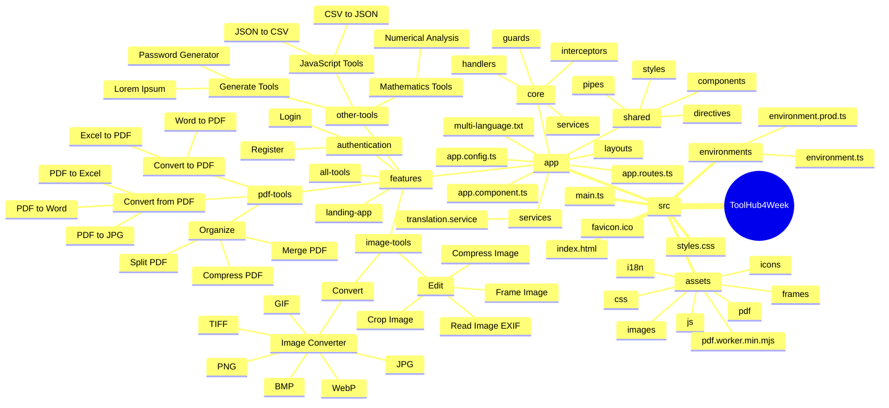

# Sơ Đồ Cấu Trúc Dự Án ToolHub4Week

## Mô Tả Chi Tiết

### Cấu Trúc Thư Mục Dự Án

Dự án ToolHub4Week được tổ chức theo nguyên tắc module hóa và tổ chức theo tính năng (feature-based organization), bao gồm:

- **src/app**: Thư mục chứa mã nguồn chính của ứng dụng
  - **features**: Chứa các module tính năng chính của ứng dụng
  - **core**: Chứa các thành phần cốt lõi của ứng dụng (guards, handlers, interceptors, services)
  - **shared**: Các thành phần dùng chung (components, directives, pipes, styles)
  - **services**: Các dịch vụ dùng chung
  - **layouts**: Các layout cho ứng dụng
- **src/assets**: Thư mục chứa tài nguyên tĩnh (css, js, images, icons, frames, i18n)
- **src/environments**: Cấu hình môi trường (development và production)

### Chi Tiết Các Công Cụ

#### PDF Tools

- **Convert to PDF**: Chuyển đổi các định dạng văn bản và bảng tính sang PDF
  - _Word to PDF_: Chuyển đổi tài liệu Word (.docx, .doc) sang PDF
  - _Excel to PDF_: Chuyển đổi bảng tính Excel (.xlsx, .xls) sang PDF
- **Convert from PDF**: Chuyển đổi PDF sang các định dạng khác
  - _PDF to Word_: Chuyển đổi PDF sang tài liệu Word (.docx)
  - _PDF to Excel_: Chuyển đổi PDF sang bảng tính Excel (.xlsx)
  - _PDF to JPG_: Chuyển đổi PDF sang hình ảnh JPG
- **Organize**: Các công cụ tổ chức và quản lý PDF
  - _Compress PDF_: Nén file PDF để giảm kích thước
  - _Split PDF_: Tách một file PDF thành nhiều file nhỏ hơn
  - _Merge PDF_: Gộp nhiều file PDF thành một file

#### Image Tools

- **Convert**: Chuyển đổi giữa các định dạng hình ảnh
  - _Image Converter_: Chuyển đổi hình ảnh giữa các định dạng JPG, PNG, GIF, WebP, TIFF, BMP
- **Edit**: Các công cụ chỉnh sửa và xử lý hình ảnh
  - _Compress Image_: Nén hình ảnh để giảm kích thước
  - _Crop Image_: Cắt hình ảnh theo kích thước mong muốn
  - _Frame Image_: Thêm khung và viền cho hình ảnh
  - _Read Image EXIF_: Đọc và hiển thị thông tin metadata của hình ảnh

#### Other Tools

- **Generate Tools**: Các công cụ tạo nội dung
  - _Password Generator_: Tạo mật khẩu ngẫu nhiên an toàn
  - _Lorem Ipsum_: Tạo văn bản giả ngẫu nhiên
- **JavaScript Tools**: Các công cụ xử lý dữ liệu JavaScript
  - _JSON to CSV_: Chuyển đổi dữ liệu JSON sang định dạng CSV
  - _CSV to JSON_: Chuyển đổi dữ liệu CSV sang định dạng JSON
- **Mathematics Tools**: Các công cụ toán học
  - _Numerical Analysis_: Phân tích số học và thống kê

#### Authentication

- **Login**: Đăng nhập vào hệ thống
- **Register**: Đăng ký tài khoản mới

#### All Tools

Trang hiển thị tất cả các công cụ có sẵn trong ứng dụng

#### Landing App

Trang chủ của ứng dụng
